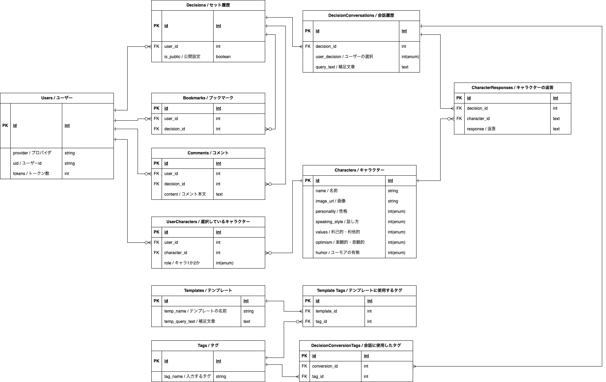

# ミライセレクト (Mirai Select)

## サービス概要

ミライセレクトは、ユーザーの悩みごとに対して異なる視点から選択肢を提示することで決断をサポートします。  
アプリ上で設定したキャラクターの性格をもとにAIが選択肢を生成し、ユーザーがどちらかを選択し、会話の履歴を残します。  
ユーザーは任意に履歴を他ユーザーに公開することができ、他のユーザーの悩みを知ることで共感や新たな知識を得ることもできます。

## 想定されるユーザー層

- ChatGPTや検索エンジンを使って欲しい検索結果を得るのに時間がかかる人
- 得た情報が多い場合に取捨選択するのが苦手な人

## サービスコンセプト

### ユーザーが抱えている課題感と解決方法

インターネット上の情報が多い、あるいは複雑で把握しきれない。  
その様な悩みに対して、異なる視点から選択肢を絞り提示することでユーザーが容易に判断できる手助けを行います。  
また、履歴一覧や自分の会話履歴に対する他ユーザーからのコメントで共感や新たな知識を得ることもできます。

### なぜそのサービスを作ろうと思ったのか

私が未経験からWEBエンジニア転職を目指そうと決意したとき、WEBエンジニアの中にも様々な業種・職種があると知り、その中で自分が目指すべきゴールはどこか、どの様なことをどの様にして学ぶべきかについて悩みました。  
調べる過程でChatGPTに質問を投げかけ、プログラミングについて独学で学んだりしましたが、漠然とした質問では漠然とした答えが返ってきてしまうため、どの様に質問すれば自分にとってより良い答えが返ってくるのか、ということを工夫するようになりました。  
そういった経験の中で、「〇〇について××という状況において有効な手段を5つ挙げてください」など、無数にある選択肢の中から少数の有力な選択肢に絞って、その中から選択する形式が有効だということに気づきました。  
ただ、毎回その様に入力するのは手間ですし、面白みにも欠けます。  
そこで漫画でよく出てくる「天使と悪魔が言い争う脳内会議」を思い浮かべて、悩み事を異なる視点から少数の選択肢に絞る様なサービスがあれば面白いと思い、本サービスを考えました。

### どのようなサービスにしていきたいか

悩みや解決策の共有プラットフォームを目指します。  
具体的には、ユーザーが自らの悩みやその解決過程を公開・非公開設定でき、  
他のユーザーが過去の悩みやその解決策にアクセス・意見交換できる、情報共有の場とします。

### どこが売りになるか、差別化ポイントになるか

- チャットボットでリアルタイムに対話形式での情報収集、取捨選択のサポートができる
- 会話履歴を他ユーザーと共有することで似た質問がないか検索できる
- 好きなキャラクターと対話しながら情報収集ができる

## 実装を予定している機能

### MVP (Minimum Viable Product)

- **ユーザー登録機能**
  - SNSアカウントによるユーザー登録（トークン数の抑制）
- **決断ヘルパー機能**
  - 最大50文字以内の文章で悩み事を入力
  - gem 'ruby-openai'を使用して、OpenAI APIに情報を送信
  - OpenAI API(GPT3.5 Turbo 4K context)からレスポンスを受け取りキャラクターからのアドバイスとして出力
  - アドバイスに対するユーザーの選択（+追加で深堀りするか決定するか）
  - 会話履歴に対してタグをつけて公開・非公開を選択
  - トークン数で管理
- **トークン制限機能**
  - トークン数はリアルタイムで表示（文字を入力したら画面上のトークン数が減る）
  - ユーザー作成時に300トークン付与する
  - トークンは毎週月曜日に100トークン付与される（最大300トークン）
- **事例一覧機能**
  - 公開設定された事例を他ユーザーが閲覧する機能
  - 閲覧したユーザーはコメントとブックマークが可能
- **マルチ検索**
  - タグ、会話内容から複合的に検索することができる
- **バックグランド処理**
  - APIからの回答を待っている間にユーザーにローディング画面を表示する

### その後の機能

- **ゲストユーザー機能**
  - 事例集機能は利用可能とする
  - ゲストユーザーが「決断ヘルパー」機能を体験できる
- **フィードバック機能**
  - 決断ヘルパー機能で決定したのちに簡単なアンケートを表示
- **ユーザープロフィール機能**
  - ユーザー情報の表示と編集
- **OGPによるSNS共有機能**
  - 天使・悪魔の画像がそれぞれ表示される様にする
- **キャラクターの追加**
  - 天使と悪魔以外のキャラクターの追加
- **カスタムキャラクター**
  - ユーザーが自由にキャラクターを追加できる様になる機能
  - 口調はアプリ側で用意されたものから選択する
  - キャラ画像はユーザーが用意する
- **テンプレート機能（文章）**
  - テンプレートを選択することで文章が自動入力される
  - 消費トークン数は手打ちで売った場合と同じ
- **テンプレート機能（タグ）**
  - テンプレートを選択することでタグが自動入力される

## 画面遷移図
https://www.figma.com/file/YADccED86hHFMbZHh1NUje/Mirai-Select?type=design&node-id=0%3A1&mode=design&t=e0jiAWiLDCinPZFv-1

## ER図

